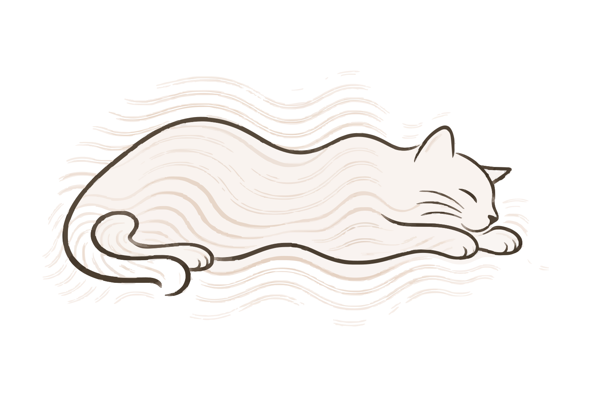

<div class="purrism-logo-header">
  
  <h1 id="scala-purrism" class="title">scala-purrism</h1>
</div>

Scalafix semantic rules for teams moving real Scala code toward Typelevel,
Cats, and Cats Effect idioms.

It is for codebases that already use `cats`, `cats-effect`, or tagless-final
style, but still carry concrete collection types, hand-written effect plumbing,
manual `Either`/`Option` branches, or local helpers that duplicate Cats APIs.
The rules make those migrations repeatable: they rewrite code, type-check the
result through SemanticDB, and avoid broad signature changes unless the
configured rule can see enough call-site context.

Use it when you need to:

- weaken concrete effect constraints such as `Sync` to the smallest Cats
  typeclass that the method actually needs
- generalize `List`/`Vector`/`Option` signatures into polymorphic collection or
  typeclass APIs
- replace local boilerplate with standard Cats syntax and functions
- reshape callback-style and environment-threading code into `Kleisli` or
  `Arrow` forms where that improves the program shape
- propagate opaque domain types from selected seed fields through assignments
  and calls

It is intentionally conservative. Rules decline when the rewrite would require
unsafe public API changes, unseen cross-file call-site edits, missing Cats
evidence, or behavior changes that are not explicitly enabled.

```scala mdoc:invisible
import cats.*
import cats.data.Kleisli
import cats.effect.{IO, Sync}
import cats.syntax.all.*
```

The examples below are compiled with **mdoc**. Diff blocks show the exact code
shape each rule rewrites, and the resulting examples are type-checked against
Cats and Cats Effect.

## Setup

Add the published rule artifact:

```text
io.github.mercurievv:scala-purrism-scalafix_3:0.8.0
```

Enable SemanticDB in the target project:

```scala
scalacOptions += "-Ysemanticdb"
```

Choose rules in `.scalafix.conf`:

Configs:

```hocon
rules = [
  TypelevelPurrism // [required] umbrella rule set
]
```

For whole-project rewrites, run Scalafix over every relevant source file and
pass every SemanticDB target root. Recompile between stages when one rule
changes signatures that another rule reads semantically.

## Rule Sets

### TypelevelPurrism

Runs `TypeclassWeakening`, `PreferKleisli`, `PreferArrow`,
`PreferTypeParameters`, and `PreferCatsExpressions`.

Configs:

```hocon
rules = [ TypelevelPurrism ] // [required] run the full recommended rule set
```

Since 0.8.0 the widening member is `PreferTypeParameters` — all three of
`PreferPolymorphicCollectionOps`, `PreferPolymorphicCollections` and
`PreferPolymorphicTypeclasses` — where it was `PreferPolymorphicTypeclasses` alone. Every
member key reaches them through the umbrella:

Configs:

```hocon
PreferArrow.aggressive = true // [optional] enable broader Arrow rewrites
PreferPolymorphicTypeclasses.widenPublic = true // [optional] allow public signature changes
PreferPolymorphicCollections.crossFile = true // [optional] inspect references across files
PreferPolymorphicCollectionOps.rewrite = false // [optional] keep signature widening, skip body rewrites
```

`PreferPolymorphicCollectionOps` is the one member that rewrites a *body*:
`mkString` becomes `mkString_`, which renders elements with `Show` rather than
`toString`. Where the two disagree the program prints something different. Set
`PreferPolymorphicCollectionOps.rewrite = false` to keep the umbrella's widenings
purely at the signature.

### PreferTypeParameters

Runs the three signature-widening rules together:
`PreferPolymorphicCollectionOps`, `PreferPolymorphicCollections`, and
`PreferPolymorphicTypeclasses`.

Configs:

```hocon
rules = [ PreferTypeParameters ] // [required] run all signature-widening rules
```

Examples:

```scala mdoc:passthrough
print(docs.DocDiff.renderRule(
  rule = "PreferTypeParameters",
  before = """
def labels[A](values: List[A]): List[String] =
  values.map(_.toString)

val out = labels[Int](List(1, 2))
""",
  config = """
PreferPolymorphicCollections.widenPublic = true
"""
))
```

### PreferCatsExpressions

Runs `PreferCatsFunctions`, `PreferCatsSyntax`, and `SimplifyCatsExpressions`
together — see [Cats Expressions](#cats-expressions) below for how they
differ.

Configs:

```hocon
rules = [ PreferCatsExpressions ] // [required] run all three expression rules
```

## Expression And Data Idioms

Local rewrites inside method bodies. These rules improve Cats usage, remove
manual collection plumbing, or make data flow more explicit without changing
the broad program architecture.

### Cats Expressions

`PreferCatsExpressions` runs three rules that all move an expression toward
the Cats API, each on a different tree shape:

| rule | shape it matches |
| --- | --- |
| `PreferCatsFunctions` | a whole method body, against an index of known Cats source functions |
| `PreferCatsSyntax` | a summoner call — `Typeclass[F].method(fa)` |
| `SimplifyCatsExpressions` | a dot-syntax sub-expression already in that shape, e.g. `fa.map(_ => ())` |

```scala mdoc:passthrough
print(docs.DocDiff.renderRule(
  rule = "PreferCatsExpressions",
  before = """
def lifted[F[_]: Applicative, A](a: A): F[A] =
  Applicative[F].pure(a)

val cleared = lifted[Option, Unit](()).map(_ => ())
"""
))
```

`lifted`'s body → `PreferCatsFunctions` (whole-body match against the index,
which happens to render as the same call `PreferCatsSyntax` would produce
here). `cleared` → `SimplifyCatsExpressions` (`.map(_ => ())` → `.void`).

Configs: none.

### Data And Collection Flow

#### PropagateOpaqueType

Introduces an opaque type and follows selected SemanticDB seed symbols through
value flow.

Examples:

```scala mdoc:passthrough
print(docs.DocDiff.renderRule(
  rule = "PropagateOpaqueType",
  before = """
final case class Task(branchName: String)
""",
  config = """
PropagateOpaqueType.types = [
  {
    name = "BranchName"
    underlying = "scala/Predef.String#"
    definitionFile = "Temp.scala"
    seeds = [ "test/Task#branchName." ]
  }
]
"""
))
```

Examples:

```scala mdoc:passthrough
print(docs.DocDiff.renderRule(
  rule = "PropagateOpaqueType",
  before = """
def checkout(branchName: String): IO[Unit] =
  IO.println(branchName)
""",
  config = """
PropagateOpaqueType.types = [
  {
    name = "BranchName"
    underlying = "scala/Predef.String#"
    definitionFile = "Temp.scala"
    seeds = [ "test/checkout().(branchName)" ]
  }
]
"""
))
```

Configs:

```hocon
PropagateOpaqueType.types = [ // [required for explicit propagation] opaque types to introduce
  {
    name = "BranchName" // [required] new opaque type name
    underlying = "scala/Predef.String#" // [optional] SemanticDB symbol for the representation
    definitionFile = "Task.scala" // [required] file where the opaque type is generated
    seeds = [ "_empty_/Task#branchName." ] // [required] starting symbols for value-flow propagation
    widen = [] // [optional] symbols allowed to keep the underlying type
  }
]
PropagateOpaqueType.debug = false // [optional] disable diagnostic output
PropagateOpaqueType.autoDiscover.enabled = false // [optional] require explicit seed config
```

#### PreferOptionIdioms

Rewrites nullable lookup and `Option.map(...).getOrElse(...)` shapes.

Examples:

```scala mdoc:passthrough
print(docs.DocDiff.renderRule(
  rule = "PreferOptionIdioms",
  before = """
def test[A, B](option: Option[A], render: A => B, default: B) =
  option.map(render).getOrElse(default)
"""
))
```

Examples:

```scala mdoc:passthrough
print(docs.DocDiff.renderRule(
  rule = "PreferOptionIdioms",
  before = """
def test[A](value: A) =
  if value == null then None else Some(value)
"""
))
```

Configs:

```hocon
PreferOptionIdioms.rewrite = true // [optional] apply Option idiom rewrites
PreferOptionIdioms.mouse = false // [optional] do not use mouse syntax helpers
```

#### PreferIndexedMap

Rewrites index loops to direct collection operations, and effectful left folds
to `foldM`.

Examples:

```scala mdoc:passthrough
print(docs.DocDiff.renderRule(
  rule = "PreferIndexedMap",
  before = """
def test(xs: List[Int]) =
  xs.indices.map(i => xs(i).toString)
"""
))
```

Examples:

```scala mdoc:passthrough
print(docs.DocDiff.renderRule(
  rule = "PreferIndexedMap",
  before = """
def test(xs: List[Int]) =
  xs.zipWithIndex.map { case (x, i) => s"$i:$x" }
"""
))
```

Configs:

```hocon
PreferIndexedMap.rewrite = true // [optional] rewrite index-based loops when safe
```

## Effectful Program Shape

Rules that alter how effects, side effects, and effectful data-in/data-out
flows are represented. These rewrites usually affect control-flow shape more
than individual expressions.

### Effect Boundaries

#### TypeclassWeakening

Weakens over-strong effect bounds when the body only needs weaker Cats
capabilities.

Examples:

```scala mdoc:passthrough
print(docs.DocDiff.renderRule(
  rule = "TypeclassWeakening",
  before = """
def bump[F[_]: Sync](fa: F[Int]): F[Int] =
    fa.map(_ + 1)
"""
))
```

Examples:

```scala mdoc:passthrough
print(docs.DocDiff.renderRule(
  rule = "TypeclassWeakening",
  before = """
def choose[F[_]: Concurrent, A](left: F[A], right: F[A]): F[A] =
  left.handleErrorWith(_ => right)
"""
))
```

Configs: none.

#### SuspendSideEffects

Reports side effects that a signature does not mention and rewrites eager
`pure(effect)` into suspended `delay(effect)` where an effect type supports it.

Examples:

```scala mdoc:passthrough
print(docs.DocDiff.renderRule(
  rule = "SuspendSideEffects",
  before = """
def test[F[_]: Sync] =
  Sync[F].pure(System.nanoTime())
"""
))
```

Examples:

```scala mdoc:passthrough
print(docs.DocDiff.renderRule(
  rule = "SuspendSideEffects",
  before = """
def read[F[_]: Sync](path: Path): F[String] =
  Sync[F].pure(Files.readString(path))
"""
))
```

Configs:

```hocon
SuspendSideEffects.rewrite = true // [optional] rewrite eager pure(effect) into delay(effect)
SuspendSideEffects.report = true // [optional] report side effects that cannot be rewritten
SuspendSideEffects.effects = [ "IO", "SyncIO", "Resource", "Stream", "Task", "EitherT", "OptionT", "Kleisli" ] // [optional] effect types to inspect
```

#### PreferEffectIdioms

Rewrites decidable effect idioms and reports shapes that need a wider program
decision.

Examples:

```scala mdoc:passthrough
print(docs.DocDiff.renderRule(
  rule = "PreferEffectIdioms",
  before = """
def test[A](work: () => A, fallback: () => A) =
  try work()
  catch { case _: Throwable => fallback() }
"""
))
```

Examples:

```scala mdoc:passthrough
print(docs.DocDiff.renderRule(
  rule = "PreferEffectIdioms",
  before = """
def test(open: () => Unit, close: () => Unit) =
  try open()
  finally close()
"""
))
```

Configs:

```hocon
PreferEffectIdioms.rewrite = true // [optional] apply decidable rewrites
PreferEffectIdioms.resources = true // [optional] suggest Resource for acquire/release shapes
PreferEffectIdioms.refs = true // [optional] inspect mutable reference idioms
```

### Kleisli And Arrow

#### PreferKleisli

Turns effectful data-in/data-out methods into `Kleisli` values and re-splits
direct call sites.

Examples:

```scala mdoc:passthrough
print(docs.DocDiff.renderRule(
  rule = "PreferKleisli",
  before = """
def load[F[_]: Monad](id: Long): F[String] =
  id.toString.pure[F]

val loaded: IO[String] = load[IO](42)
"""
))
```

Examples:

```scala mdoc:passthrough
print(docs.DocDiff.renderRule(
  rule = "PreferKleisli",
  before = """
def save[F[_]: Monad](name: String): F[Unit] =
  name.trim.pure[F].void

val saved: IO[Unit] = save[IO]("  Ada  ")
"""
))
```

Configs:

```hocon
PreferKleisli.fileLocalOnly = false // [optional] update call sites outside the defining file
PreferKleisli.crossFile = true // [optional] inspect references across files
PreferKleisli.crossFileRoot = "." // [optional] project root for cross-file lookup
```

#### PreferArrow

Rewrites hand-threaded `Kleisli` bodies into Arrow composition such as `>>>`,
`.map`, and `&&&`.

Examples:

```scala mdoc:passthrough
print(docs.DocDiff.renderRule(
  rule = "PreferArrow",
  before = """
def test[F[_]: Functor](load: Kleisli[F, Long, String]) =
  Kleisli { (id: Long) => load.run(id).map(_.trim) }
"""
))
```

Examples:

```scala mdoc:passthrough
print(docs.DocDiff.renderRule(
  rule = "PreferArrow",
  before = """
def test[F[_]: Monad](load: Kleisli[F, Long, String], validate: Kleisli[F, String, String]) =
  Kleisli { (id: Long) => load.run(id).flatMap(validate.run) }
"""
))
```

Configs:

```hocon
PreferArrow.aggressive = false // [optional] keep rewrites conservative
PreferArrow.reportSkips = false // [optional] omit diagnostics for declined rewrites
```

## Polymorphic API Shape

Signature-level rules that generalize concrete APIs to type parameters. They
need broader semantic confidence because they can change method boundaries and
call sites, not only local expressions.

### Polymorphic Signatures

Three rules widen one concrete type constructor in a signature to a type
parameter, each over a different subject — never the same parameter twice:

| rule | subject | touches the body? |
| --- | --- | --- |
| `PreferPolymorphicTypeclasses` | any unary constructor Cats has — `Eval`, `Show`, `Option`, domain types — except collections | no |
| `PreferPolymorphicCollections` | `List`/`Seq`/`Vector`/... (`containers`) | no |
| `PreferPolymorphicCollectionOps` | same collections, only bodies calling `mkString`/`sum`-like ops | **yes** — renames the call too, e.g. `mkString` → `mkString_` |

One file, one method per rule, run through the umbrella `PreferTypeParameters`:

Examples:

```scala mdoc:passthrough
print(docs.DocDiff.renderRule(
  rule = "PreferTypeParameters",
  before = """
final class Summary {
  private def names(users: List[String]): List[String] =
    users.map(user => user.toUpperCase)

  private def rendered(rows: List[String]): String =
    rows.mkString("[", ",", "]")

  private def duplicate(e: Eval[Int]): Eval[Int] =
    e.coflatMap(w => w.extract + 1)
}
"""
))
```

`names` → `PreferPolymorphicCollections`. `rendered` → `PreferPolymorphicCollectionOps`
(signature *and* the call). `duplicate` → `PreferPolymorphicTypeclasses` (not a collection).

Configs:

```hocon
PreferPolymorphicTypeclasses.containers = [ "List", "Seq", "Vector", "IndexedSeq", "LazyList" ] // [optional] exclude collection constructors from this rule
PreferPolymorphicTypeclasses.widenPublic = false // [optional] keep public APIs unchanged
PreferPolymorphicTypeclasses.maxConstraints = 2 // [optional] cap added typeclass constraints

PreferPolymorphicCollections.containers = [ "List", "Seq", "Vector", "IndexedSeq", "LazyList" ] // [optional] collection constructors eligible for widening
PreferPolymorphicCollections.widenPublic = false // [optional] keep public APIs unchanged
PreferPolymorphicCollections.maxConstraints = 2 // [optional] cap added typeclass constraints

PreferPolymorphicCollectionOps.containers = [ "List", "Seq", "Vector", "IndexedSeq", "LazyList" ] // [optional] collection constructors eligible for body-aware widening
PreferPolymorphicCollectionOps.elements = [ "String", "Int", "Long", "Double", "Boolean", "..." ] // [optional] element types with supported ops
PreferPolymorphicCollectionOps.rewrite = true // [optional] also rewrite affected body calls
```

All three also take `rewrite`, `crossFile`, and `crossFileTargetroots`.

## Cross-File Keys

The signature-widening rules read these keys from their own config block:

Configs:

```hocon
PreferPolymorphicCollections.crossFile = true // [optional] inspect references across files
PreferPolymorphicCollections.crossFileRoot = "." // [optional] project root for cross-file lookup
PreferPolymorphicCollections.crossFileTargetroots = [ "out" ] // [optional] SemanticDB target roots
```

Use `crossFileTargetroots = [ "target" ]` for sbt-style output, or `["out"]`
for Mill-style output. Compile first; stale SemanticDB means stale decisions.

## More

- [Engineering rules](https://github.com/MercurieVV/scala-purrism/blob/master/docs/RULES.md)
- [Golden fixtures](https://github.com/MercurieVV/scala-purrism/blob/master/docs/GOLDEN_FIXTURES.md)
- [Prefer Cats Functions contract](https://github.com/MercurieVV/scala-purrism/blob/master/docs/PREFER_CATS_FUNCTIONS.md)
- [Kleisli to Arrow catalogue](https://github.com/MercurieVV/scala-purrism/blob/master/docs/ARROW_PATTERNS.md)
- [Publishing](https://github.com/MercurieVV/scala-purrism/blob/master/docs/PUBLISHING.md)
